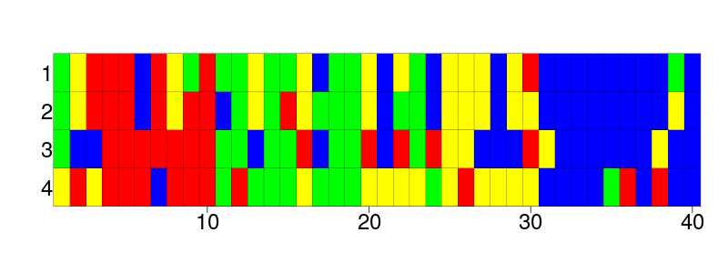

> Example text below

# Summary

All species on Earth are related to one another.
They inherit their features from their ancestors
 
And all species on Earth use DNA to store the blueprint of their features,
which they inherited from their ancestors.
That DNA carries traces of a species'
evolutionary history, as species that are closely related have more similar
DNA. The field of phylogenetics tries to conclude the evolutionary
history of species from their DNA sequences. To do so, the
researcher needs to pick a model of how evolution works. The problem is,
that there are many models to pick from.

Caption: phylogenetics in a nutshell: deriving the evolutionary history
of species (at the right) from their DNA sequences (at the left)

``mcbette`` is an R package that helps to pick the best model. conclude 
the evolutionary history of species from their DNA sequences. 
The 'best way', in this context, is that what is 'simple enough, but not 
simpler'. 

``mcbette`` builds heavily upon the ``babette`` R package [@Bilderbeek:2018],
that uses the tool 

``Gala`` was designed to be used by 
both astronomical researchers and by
students in courses on gravitational dynamics or astronomy. It has already been
used in a number of scientific publications [@Pearson:2017] and has also been
used in graduate courses on Galactic dynamics to, e.g., provide interactive
visualizations of textbook material [@Binney:2008]. The combination of speed,
design, and support for Astropy functionality in ``Gala`` will enable exciting
scientific explorations of forthcoming data releases from the *Gaia* mission
[@gaia] by students and experts alike.

# Mathematics

|site_model_name |clock_model_name |tree_prior_name | marg_log_lik| marg_log_lik_sd|    weight|
|:---------------|:----------------|:---------------|------------:|---------------:|---------:|
|JC69            |strict           |yule            |    -179.9266|        2.427167| 0.2823000|
|HKY             |strict           |yule            |    -182.2376|        1.992356| 0.0279950|
|TN93            |strict           |yule            |    -179.0459|        2.446301| 0.6810869|
|GTR             |strict           |yule            |    -183.4157|        2.636430| 0.0086181|

Single dollars ($) are required for inline mathematics e.g. $f(x) = e^{\pi/x}$

Double dollars make self-standing equations:

$$\Theta(x) = \left\{\begin{array}{l}
0\textrm{ if } x < 0\cr
1\textrm{ else}
\end{array}\right.$$

# Citations

Citations to entries in paper.bib should be in
[rMarkdown](http://rmarkdown.rstudio.com/authoring_bibliographies_and_citations.html)
format.

For a quick reference, the following citation commands can be used:
- `@author:2001`  ->  "Author et al. (2001)"
- `[@author:2001]` -> "(Author et al., 2001)"
- `[@author1:2001; @author2:2001]` -> "(Author1 et al., 2001; Author2 et al., 2002)"

# Figures

Figures can be included like this: 

# Acknowledgements

We acknowledge contributions from Brigitta Sipocz, Syrtis Major, and Semyeong
Oh, and support from Kathryn Johnston during the genesis of this project.

# References

